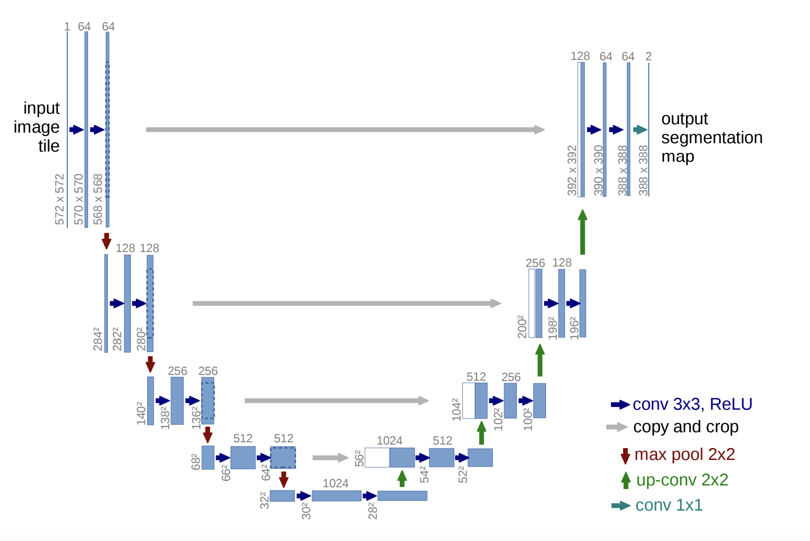

# U-net
## Abstract
Medical image segmentation is pivotal in enhancing diagnostic accuracy, treatment planning, and patient monitoring. Despite the success of [U-Net](DBLP:journals/corr/RonnebergerFB15) in this domain, challenges persist due to the variability in medical images and the rapid evolution of deep learning technologies. This study proposes the re-implementation of U-Net to incorporate recent advancements in deep learning, aiming to improve segmentation accuracy and efficiency. By leveraging modern computational techniques and a comprehensive dataset, this research seeks to develop a robust model that enhances diagnostic workflows and patient outcomes through improved segmentation performance. code can be found [here](https://github.com/ECE176/U-net).

## Introduction
The segmentation of medical images is a fundamental task in the analysis of biomedical data, enabling the isolation of specific anatomical structures for diagnostic and therapeutic purposes. Traditional segmentation methods often require significant manual effort and are prone to subjectivity. The introduction of U-Net revolutionized medical image segmentation by providing a framework designed specifically for biomedical images, demonstrating remarkable efficiency and accuracy with minimal data. However, with the continuous advancement in imaging technologies and deep learning methodologies, there is a compelling need to revisit and enhance U-Net's architecture to address current and future challenges in medical image analysis. This study focuses on re-implementing U-Net by integrating state-of-the-art deep learning techniques to achieve superior segmentation accuracy and operational efficiency, facilitating better clinical decision-making and patient care.

## Related Work
The development of U-Net catalyzed a wave of innovation in medical image segmentation, serving as a foundational model from which numerous adaptations and enhancements have emerged. Building upon its initial design, researchers have introduced variants like [V-Net](DBLP:journals/corr/MilletariNA16) for volumetric data, alongside modifications that leverage advanced deep learning techniques, including attention mechanisms and residual connections. These adaptations have been instrumental in addressing the unique challenges presented by various medical imaging modalities, underscoring U-Net's versatility and its pivotal role in the ongoing evolution of computational techniques for biomedical imaging. Future iterations may explore the integration of unsupervised learning to navigate the scarcity of annotated datasets, employ transfer learning to ensure adaptability across diverse imaging tasks, and develop end-to-end learning frameworks for a more streamlined segmentation process.

## Dataset

The medical images in the dataset are particularly focused on brain scans displaying tumors. These images are invaluable for developing and refining algorithms for the accurate segmentation of brain tumors, which is a critical step in diagnosis and treatment planning. Each scan within the dataset has been carefully selected to represent the variability and complexity one would expect to encounter in a clinical setting. This variability presents challenges in terms of image quality, tumor size, location, and appearance, which the U-Net model must learn to navigate.

## Methodology
### Network Architecture
The network architecture is illustrated in Figure 2. Its structure is characterized by a symmetric "U-shaped" design, consisting of two main parts: the contracting (downsampling) path and the expansive (upsampling) path. 

The contracting path follows the typical architecture of a convolutional network, comprising repeated application of two 3x3 convolutions,  followed by rectified linear unit (ReLU) activation functions and 2x2 max-pooling operations for downsampling, which reduce the spatial dimensions while increasing the feature depth. The expansive path is formed by alternating 2x2 up-convolutions and concatenations with a cropped feature map from the contracting path and followed by regular 3x3 convolutional layers. Skip connections between the downsampling and upsampling layers help recover the spatial context lost during downsampling, which is crucial for accurate segmentation, especially in medical imaging, where precise localization is required.

For optimization, we incorporate padding into the 3x3 convolution layer to maintain the feature layer's height and width unchanged. Position batch normalization between the convolution and activation layers. Substitute ReLU with Leaky ReLU, switch from max pooling to average pooling and apply dilated convolutions for downsampling. 
I've also tried transposed convolution for higher-quality upsampling and incorporated dropout, but these adjustments don't appear to be effective with this dataset.

### Data Preprocessing
We read image and corresponding annotation data in COCO JSON format, generating binary mask images for segmentation, and organizing these images into structured directories for training, validation, and testing. Then we generate mask images from the polygon annotations found in the JSON file, which are then saved as TIFF files. Finally, loads the images and their respective masks, applies specified transformations, and returns the transformed image and mask pairs.

Reference from [here](https://www.kaggle.com/code/kevin114514/brain-tumor-unet-zoo).

### Data Augmentation
We provide a way to randomly augment brain MRI images and their corresponding masks with slight translations and small rotations, which are more appropriate for medical imaging than flips or large rotations.

Slight Translations: The translate tuple is created with random values, and the TF.affine function is used to apply a translation to the image and mask. The translation simulates small shifts in the patient's position.

Small Rotations: Instead of larger random rotations, the rotation is limited to a range of -5 to 5 degrees. This reflects more realistic clinical variations in patient positioning during the MRI scan. 

Such augmentations can help improve the robustness and generalization of a deep learning model by providing it with variations of the data that still represent realistic scenarios. The key in medical image augmentation is to ensure that the modifications still preserve the clinical relevance and do not introduce misleading changes

### Training
For training loss, we merge Dice loss with cross-entropy loss. It sums the Dice loss and the BCE loss computed with logits (combining a sigmoid layer and the BCE loss in a numerically stable way). It combines the benefits of the Dice coefficient, which is excellent for segmentation overlap, with the pixel-wise classification accuracy of BCE, providing a comprehensive loss function for segmentation tasks.

## Result
